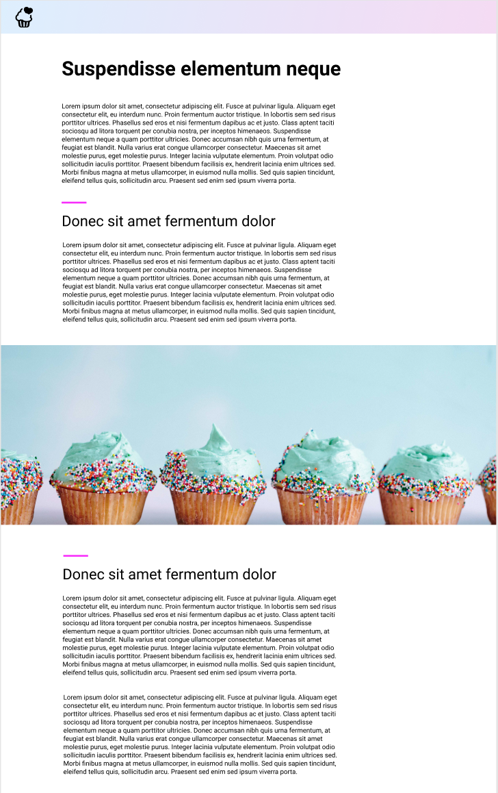

# Cupcake factory

Create a page similar to the example image:

* [] the site header is fixed, and when scrolling remains at the top of the viewport
* [] the header has a linear gradient
* [] the header does not overlap any content
* [] content is centered on the page
* [] text has 80% width
* [] cupcake image extends to the edges of the viewport
* [] second level headlines have a little purple line on top them
* [] can you make the little purple line a gradient?
